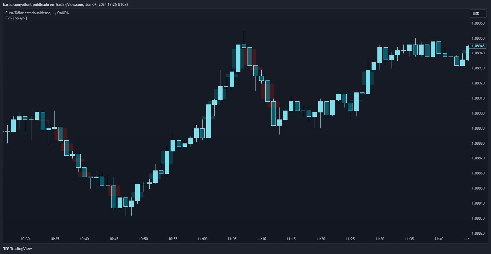

# FVG-imbalance-TradingView

El indicador "FVG [bpuyol]" está diseñado para la plataforma TradingView, una herramienta popular entre traders e inversores para analizar gráficos de precios y tomar decisiones informadas. Este indicador está programado con Pine Script, el lenguaje de scripting de TradingView.

## ¿Qué es un Indicador en TradingView?

Un indicador en TradingView es una herramienta que ayuda a los traders a analizar los datos del mercado, identificar patrones y tomar decisiones de trading. Los indicadores pueden resaltar tendencias, volúmenes, volatilidad y otras características del mercado, proporcionando información visual y cuantitativa para mejorar las estrategias de trading.

## Descripción del Indicador: "FVG [bpuyol]"

El indicador "FVG [bpuyol]" detecta y resalta brechas de valor justo (FVG) durante las sesiones de Londres y Nueva York. Visualiza áreas de desequilibrio de precios con colores personalizables para FVG alcistas y bajistas, facilitando la identificación de posibles zonas de liquidez y oportunidades de trading.

### Características Principales:

#### Sesiones de Mercado:
- Habilita la detección de FVG específicamente durante las sesiones de Londres y Nueva York.
- Permite personalizar los horarios de las sesiones para adaptarse a diferentes zonas horarias y preferencias de análisis.

#### Detección de Brechas de Valor Justo (FVG):
- Identifica y marca las brechas de valor justo alcistas y bajistas en el gráfico.
- Utiliza colores personalizables para diferenciar claramente entre las brechas alcistas (color azul) y bajistas (color rojo).
- Ofrece la opción de extender las brechas en el gráfico para un seguimiento visual más prolongado.

### Visualización Intuitiva:
- Las brechas alcistas se muestran con un fondo semitransparente azul y una línea central azul.
- Las brechas bajistas se muestran con un fondo semitransparente rojo y una línea central roja.

### Cómo Utilizarlo:

#### Configuración:
- Al agregar el indicador al gráfico, puedes habilitar o deshabilitar la detección de FVG durante las sesiones de Londres y Nueva York según tus necesidades de análisis.
- Personaliza los horarios de las sesiones directamente en la configuración del indicador.

#### Interpretación:
- Las áreas resaltadas por el indicador representan posibles zonas de desequilibrio de precios.
- Estas zonas pueden actuar como áreas de interés para posibles oportunidades de trading, donde el precio podría regresar para llenar la brecha.

#### Personalización:
- Ajusta los colores y la extensión de las brechas en el gráfico para que se adapten a tu estilo de análisis y preferencias visuales.

### Beneficios:

#### Identificación Clara de Oportunidades:
- Las FVG pueden proporcionar indicaciones valiosas sobre posibles movimientos futuros del precio, permitiendo a los traders anticipar posibles puntos de entrada y salida.

#### Alineación con Sesiones de Mercado:
- La capacidad de limitar la detección de FVG a sesiones de mercado específicas ayuda a centrarse en los períodos de mayor actividad y relevancia.

El indicador "FVG [bpuyol]" es una herramienta útil para cualquier trader que busque mejorar su análisis técnico mediante la identificación de desequilibrios de precios y aprovechar las oportunidades que estas zonas pueden ofrecer.

## Prueba el Indicador

Accede al indicador en TradingView y comprueba su utilidad por ti mismo. [Haz clic aquí para ver el indicador](https://es.tradingview.com/script/TVn2fcFe/).
